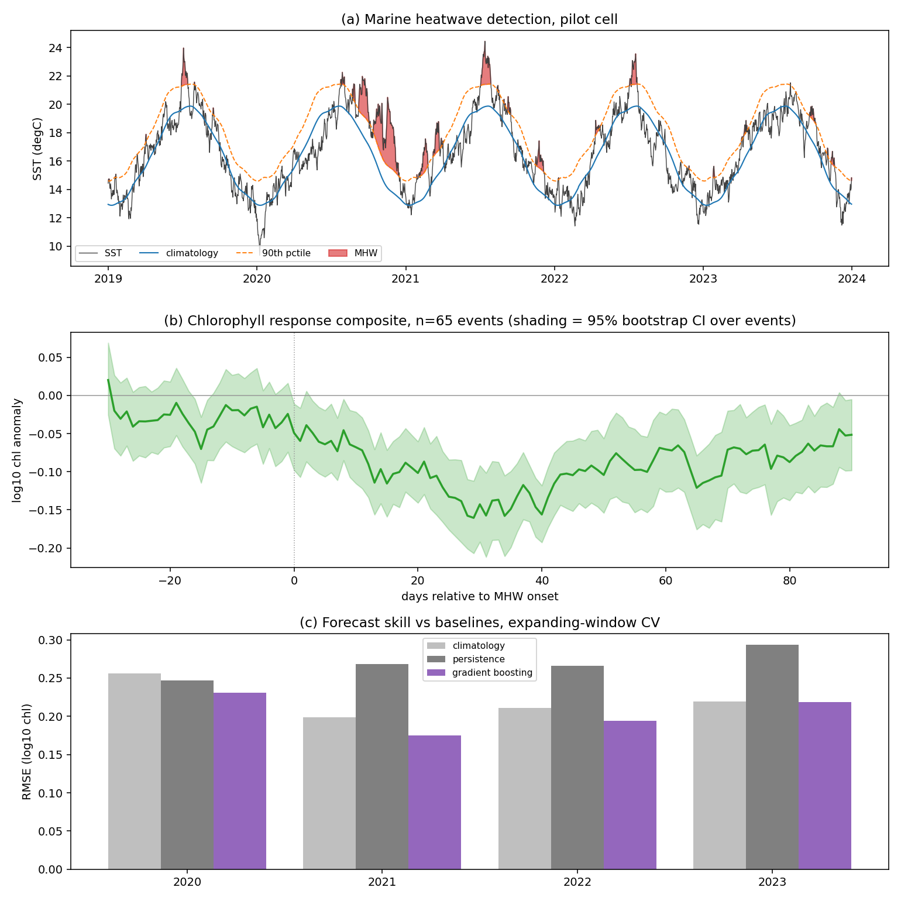

# Marine heatwaves and phytoplankton — Ocean Hackathon

[](https://github.com/YOUR-USER/YOUR-REPO/actions/workflows/pipeline.yml)
[](https://colab.research.google.com/github/YOUR-USER/YOUR-REPO/blob/main/notebooks/demo.ipynb)
[](LICENSE)

Detect marine heatwaves (MHWs) from satellite SST, measure the **lagged and
sign-ambiguous** chlorophyll response, and forecast that response at a
multi-week lead time.

The scientific claim we are trying to support is not "MHWs harm
phytoplankton". It is that the response is **regime-dependent**: in
stratified waters heat suppresses nutrient supply and chlorophyll falls,
while in light- or mixing-limited waters the same heat can advance and boost
a bloom. The deliverable is a map of *where, when, with what lag, and with
what sign*.




*(a) Hobday-definition heatwave detection. (b) Chlorophyll composite on event onset — the response is negative, peaks around 30 days after onset, and recovers slowly. (c) The forecast against its baselines.*

## Status

Walking skeleton is complete and passing. Run it:

```bash
pip install -r requirements.txt
python -m pytest tests -q                    # 9 passed
python scripts/run_walking_skeleton.py       # end-to-end on synthetic data
```

Current output on synthetic data (26 years, 6x6 cells, daily):

| stage | result |
|---|---|
| MHW detection | 2094 events, 2.24 events/cell/yr, mean duration 13.1 d |
| Response regimes | 15 cells down, 15 up, 6 no response |
| **Acceptance test** | **100% regime sign accuracy vs planted ground truth** |
| Forecast (+28 d) | mean skill +0.127 vs best baseline, range +0.007 to +0.224 |

## The one design decision that matters

**No real data was used to build this, on purpose.** My sandbox cannot reach
NOAA or CMEMS, so `synth.py` generates an ocean with a *planted* MHW ->
chlorophyll response — negative and lagged 21 d in one region, positive and
lagged 7 d in another, plus a control region with no response at all.

Step 4 of the skeleton then checks whether the analysis recovers what was
planted. It does, at 100%, including correctly reporting "no response" in the
control cells — so the method is not manufacturing signal from noise.

This matters for two reasons. Practically, the pipeline is debugged before
the real download finishes. Rhetorically, "here is our method recovering a
known answer" is a much stronger slide than a correlation with no null.

Note one honest artefact: permutation importance ranks `mld` top, but in the
synthetic ocean MLD was *constructed* from the SST anomaly, so that ranking
is circular by construction. Expect it to change on real data — and do not
quote it in the pitch until it has.

## Layout

```
src/mhwphyto/
  mhw.py         Hobday (2016) detection: DOY climatology, 90th-pctile
                 threshold, >=5 day runs, <=2 day gap joining, Hobday (2018)
                 categories 1-4. Pure numpy, unit tested.
  composite.py   log10 chl anomaly; event-relative lag composites with
                 bootstrap CI resampled over EVENTS not days; regime labels;
                 recovery time.
  forecast.py    feature builder (cumulative MHW degC-days, MLD, PAR, lagged
                 chl, seasonal harmonics), persistence + climatology
                 baselines, expanding-window CV by year, Brier score for
                 "bloom failure".
  data.py        loader with identical interface for synthetic / local /
                 CMEMS, plus the product shopping list.
  synth.py       ground-truth ocean generator.
scripts/run_walking_skeleton.py
tests/test_mhw.py
outputs/         events CSV, response map, fold table, importances, figure
```

## Deliberate methodological choices, and why

| choice | reason |
|---|---|
| Fixed 30-year climatological baseline | A shifting baseline makes a warming trend invisible — MHWs get redefined away. |
| Bootstrap over **events**, not days | Days inside an event are strongly autocorrelated; resampling days inflates n and fabricates significance. |
| Anomalies in **log10** space | Chlorophyll is log-normal. Linear-space means are dominated by bloom outliers. |
| Expanding-window CV by year | Random k-fold on a time series leaks the future backwards through autocorrelation and flatters any model. |
| Baselines computed **first** | A model that loses to persistence is a real finding. Skill is reported as fractional MSE reduction against the *better* baseline. |
| Control region with no planted response | Guards against a pipeline that finds a response everywhere. |

## Parallel workstreams

Interfaces are already fixed, so these tracks can proceed simultaneously
without blocking each other. The contract is the canonical dataset schema in
`data.harmonise` (variables `sst`, `chl`, optional `mld`, `par`, `nppv`,
`no3`, on `time`/`lat`/`lon`) and the events table from `mhw.detect_grid`
(columns including `start_index`, `duration`, `intensity_*`, `category`,
`lat_index`, `lon_index`).

**Track A — data acquisition (must start now, human, needs network)**
Register for Copernicus Marine, `copernicusmarine login`, verify every
product ID in `data.CANDIDATE_PRODUCTS` against the live catalogue, subset
one region, write it to zarr with `data.cache_to_zarr`. *Done when*
`run_walking_skeleton.py --source local --path ...` completes. This is the
critical path and the only track that can sink the project.

**Track B — regional science choice**
Pick and defend one region. Mediterranean has huge MHW signal and excellent
coverage; Bay of Biscay suits a Brest audience; the 2013-15 NE Pacific "Blob"
has a deep validation literature to check yourself against. *Done when* the
region, the baseline period, and two named historical events to validate
against are written down.

**Track C — mechanism attribution**
Add MLD, nitrate and PAR to the composite so the story is causal, not just
correlational. Then the counterfactual: force a simple NPZD box model with
observed SST/MLD, re-run with the MHW removed from the forcing, and report
the difference as an *attribution*. Interface: consumes the same cube.

**Track D — community composition**
Swap total chlorophyll for the PFT variables and test whether MHWs shift the
assemblage from diatoms toward dinoflagellates and picoplankton. Ecologically
this is the consequential result, because it propagates to food webs and
carbon export rather than just standing stock. Interface: `chl` -> one PFT
variable, everything else unchanged.

**Track E — forecast hardening**
Extend from the single pilot cell to the full grid, tune leads (7/14/28/56 d),
report the Brier-score framing, and add a reliability diagram. Resist
reporting anything without its baseline.

**Track F — presentation**
The jury sees a demo, not a repo. Build the interactive map from
`outputs/response_map.csv`, and rehearse the caveats *before* they are asked:
satellite chlorophyll is surface-only and unreliable in turbid coastal water;
cloud gaps bias event windows; and photoacclimation changes the chl:carbon
ratio under warming, so a chlorophyll drop is not necessarily a biomass drop.

## Caveats on this repo

- Citations (Hobday et al. 2016 / 2018) and all CMEMS product IDs were
  written from memory without network access. **Verify before relying on
  them.**
- The forecast skill number is from synthetic data with a planted, therefore
  learnable, response. Real-world skill will be lower. Do not quote +0.127
  in the pitch.
- Grid detection loops over cells in Python. Fine at 6x6 or 50x50; for a
  full basin, vectorise the climatology and parallelise with dask.
